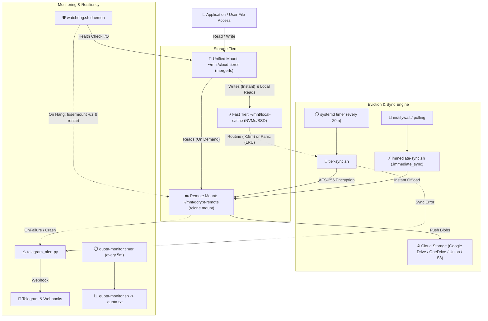

# 🛡️ Encrypted Tiered Storage (ETS)

> **Production-grade, lightweight, client-side encrypted tiered storage pipeline for Linux.**  
> Optimized for single-board computers (Raspberry Pi, Rockchip, Mini PCs) and low-resource home servers.

[](#)
[](#)
[](#)
[](#)
[](#)
[](#)
[](https://github.com/ashishsinghbora/ETS/actions)

---

## 📖 Overview

Local storage (NVMe/SSD/eMMC) provides blazing write speeds but is strictly capacity-constrained. Cloud storage provides scalable capacity, but direct cloud mounts suffer from high write latency, lack privacy, and can easily saturate network bandwidth.

**Encrypted Tiered Storage** solves this by uniting fast local storage and encrypted cloud storage into a **single, transparent mount point**:

1. **Instant Writes (Local Speed):** All new files write immediately to a fast local NVMe/SSD cache tier.
2. **Hybrid LRU Eviction:** Intelligently offloads files to the cloud using routine time rules or emergency capacity thresholds (oldest access time first).
3. **Immediate Sync Bypass:** A dedicated `.immediate_sync/` directory watches for files and offloads them to cloud storage instantly.
4. **Client-Side Zero-Knowledge Encryption:** Files, directory structures, and filenames are encrypted with `rclone crypt` (AES-256) *before* leaving your machine.
5. **Mount Watchdog Daemon:** Real-time health monitoring of FUSE mounts with automatic lazy unmount and clean service recovery.
6. **Live Terminal Monitor & Setup TUI:** Full interactive Textual-powered configuration wizard (`ets-setup`) and live dashboard monitor (`ets-monitor`).
7. **Multi-Cloud Pooling:** Combine multiple cloud providers (Google Drive, OneDrive, B2, S3) into a single virtual encrypted pool via rclone `union`.
8. **Real-Time Quota & Capacity:** Visibility into cloud and local capacity via `.quota.txt` and passthrough `df -h` metrics.
9. **Smart Filer Organization:** Optionally organizes documents, routes photos by EXIF date, and archives inactive Git repositories before upload.
10. **Zero-Dependency Alerts:** Immediate Telegram or webhook failure alerts with rate-limiting and duplicate debouncing.
11. **Ultra Lightweight & Rootless:** 100% rootless systemd user services — zero Docker, zero databases, and zero heavy background daemons.

---

## 🏗️ Architecture



---

## ⚡ Hybrid Eviction Explained

The eviction engine in `tier-sync.sh` operates under a dual-pass rule:

```text
Evict(file) = (FileAge >= SYNC_MIN_AGE)  OR  (LocalCacheUsage% >= PANIC_THRESHOLD)
```

1. **Routine Rule (Time-Based):**
   Runs every `SYNC_INTERVAL` (e.g. 20 mins). Any file that has been sitting in the local cache for longer than `SYNC_MIN_AGE` (e.g. 15 mins) is moved to the encrypted cloud tier and evicted locally.
2. **Panic Rule (Capacity-Based):**
   If local cache filesystem usage reaches or exceeds `PANIC_THRESHOLD` (default 80%), the system enters emergency panic eviction. It sorts all cached files by **least recently accessed (atime)** and evicts oldest-used files one by one until disk usage drops back down to `PANIC_TARGET` (default 60%).
3. **Immediate Bypass (`.immediate_sync`):**
   Any file written or moved into `~/mnt/cloud-tiered/.immediate_sync/` bypasses all timers and is offloaded to the encrypted cloud remote immediately. If `inotifywait` is unavailable, it gracefully degrades to periodic polling.

---

## 🚀 Quickstart

### 1. Prerequisites
- A Linux system (Debian, Ubuntu, Arch Linux, Fedora, Alpine, or Raspberry Pi OS).
- An existing, authenticated rclone cloud remote (e.g., `gdrive:`, `onedrive:`, `s3:`).  
  *If you haven't configured one yet, run `rclone config` first.*
- *(Optional)* A Telegram bot token and chat ID or webhook URL for alerts.
- *(Optional)* `pip install --user textual rich` for the terminal UI tools.

### 2. Interactive Setup (TUI Wizard)

For a guided, visual configuration experience:

```bash
git clone https://github.com/ashishsinghbora/ETS.git
cd ETS
./scripts/ets-setup
```

### 3. Or One-Command Script Setup

```bash
cp config.env.example config.env
nano config.env
./setup.sh
```

#### Configuration Variables

| Variable | Description | Default |
| :--- | :--- | :--- |
| `CLOUD_REMOTE` | Existing unencrypted rclone remote name | `gdrive` |
| `CLOUD_REMOTE_FOLDER` | Subfolder on the remote for encrypted blobs | `encrypted` |
| `CRYPT_REMOTE` | Name for the client-side crypt remote | `gcrypt` |
| `CRYPT_PASSWORD` | Crypt password (leave blank to auto-generate) | *auto-generated* |
| `STORAGE_BASE_DIR` | Base directory for mounts | `$HOME/mnt` |
| `SYNC_MIN_AGE` | Demote files older than this (Routine rule) | `15m` |
| `SYNC_INTERVAL` | Frequency of background sync timer | `20m` |
| `SYNC_BWLIMIT` | Bandwidth throttle during cloud uploads | `5M` |
| `PANIC_THRESHOLD` | Cache disk % that triggers emergency LRU eviction | `80` |
| `PANIC_TARGET` | Cache disk % target to stop emergency LRU eviction | `60` |
| `SMART_FILER_ENABLED` | Pre-upload document, photo, and git organization | `false` |
| `TELEGRAM_ALERTS_ENABLED`| Enable instant failure/crash alerts | `true` |
| `TELEGRAM_BOT_TOKEN` | Telegram bot token | `""` |
| `TELEGRAM_CHAT_ID` | Telegram user or group chat ID | `""` |
| `WEBHOOK_URL` | Optional generic webhook fallback (Discord/Slack) | `""` |

#### Setup Flags
```bash
./setup.sh --latest    # Queries and downloads the latest mergerfs release from GitHub
./setup.sh --dry-run   # Validates environment and config without writing files or starting units
```

---

## 🖥️ Live Terminal Dashboard (`ets-monitor`)

Launch the real-time dashboard anytime:
```bash
ets-monitor
```

- **Storage Gauges:** Live visual progress bars for local cache and cloud capacity.
- **Service Grid:** Instant status indicators for all user systemd units and timers.
- **Interactive Hotkeys:**
  - `F`: Run manual Full Demotion Sync
  - `S`: Trigger Smart Filer pass
  - `P`: Trigger Emergency Panic LRU Eviction
  - `R`: Refresh metrics
  - `Q`: Quit

---

## 🧪 Verification & Self-Test

Run the automated 10-step verification suite at any time:
```bash
./test.sh
```

**Verification Coverage:**
1. ✅ Mount availability on `~/mnt/cloud-tiered`
2. ✅ Instant local write performance
3. ✅ Routine background sync offload
4. ✅ Local cache eviction and space recovery
5. ✅ Transparent end-to-end read verification
6. ✅ Immediate sync bypass (`.immediate_sync`)
7. ✅ Emergency panic LRU eviction logic
8. ✅ Real-time quota metrics in `.quota.txt`
9. ✅ Smart Filer document, photo, and git archive routing
10. ✅ Comprehensive `doctor.sh` pipeline health diagnosis

---

## 🛠️ Daily Operations & Cheat Sheet

### Storage Paths
- **Unified Working Directory (Write/Read here):** `~/mnt/cloud-tiered`
- **Instant Cloud Bypass Directory:** `~/mnt/cloud-tiered/.immediate_sync`
- **Fast Local Cache Tier:** `~/mnt/local-cache`
- **Encrypted Cloud Mount:** `~/mnt/gcrypt-remote`
- **Capacity & Quota Stats:** `~/mnt/cloud-tiered/.quota.txt`

### Health Check Doctor
Run the diagnostic doctor anytime to inspect binary versions, mount states, systemd units, and remote connectivity:
```bash
doctor.sh
```

### Checking Status & Real-time Logs
```bash
# Check status of all storage units
systemctl --user status rclone-mount mergerfs-mount immediate-sync tier-sync.timer quota-monitor.timer watchdog.service

# Follow logs in real-time
journalctl --user -u tier-sync.service -f
journalctl --user -u immediate-sync.service -f
journalctl --user -u watchdog.service -f
```

### Manually Triggering a Sync
```bash
# Preview what would be evicted without making any changes
tier-sync.sh --dry-run

# Trigger standard scheduled demotion
systemctl --user start tier-sync.service

# Sync everything immediately (ignoring 15-minute wait)
SYNC_MIN_AGE=0s tier-sync.sh
```

---

## 📚 Guides & Documentation

- 🌐 **[Multi-Cloud Union Pooling](docs/MULTI-CLOUD.md)** — Combine Google Drive, OneDrive, B2, and S3 into a single encrypted pool.
- 🎬 **[Real-World Application Blueprints](docs/USE-CASES.md)** — Detailed configs for Plex/Jellyfin, Nextcloud, Frigate NVR, and Torrent Seedboxes.
- 🤝 **[Contributing Guidelines](CONTRIBUTING.md)** — Code style, linting (`shellcheck`, `shfmt`), and test procedures.

---

## 🔐 Disaster Recovery & Remote Restoration

Because encryption uses standard `rclone crypt`, your data is never trapped in a proprietary tool:

1. Install `rclone` on any machine (Linux, macOS, Windows).
2. Configure a crypt remote pointing to `<remote>:encrypted` with your password.
3. Access or restore your files directly using `rclone copy` or `rclone mount`.

> [!CAUTION]
> **Backup Your Password:** The encryption password is the single point of failure. Store it in a secure password manager outside this machine.

---

## 🧹 Teardown / Uninstallation

To cleanly stop mounts and remove systemd units:
```bash
./uninstall.sh
```
*(Your local files, cloud remote files, and rclone configurations are preserved).*

---

## 📄 License
MIT License. Free for personal and commercial use.
