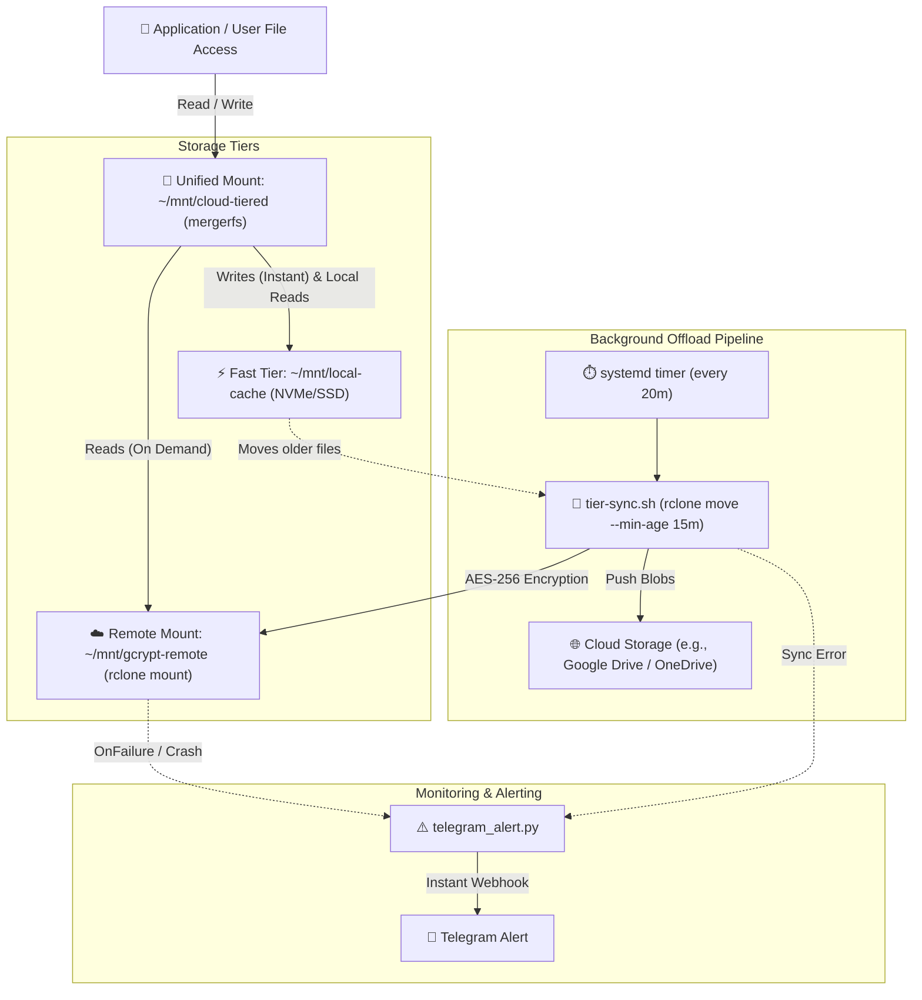

# 🛡️ Encrypted Tiered Cloud Storage

> **Production-grade, lightweight, client-side encrypted tiered storage pipeline for Linux.**  
> Optimized for single-board computers (Raspberry Pi, Rockchip, Mini PCs) and low-resource home servers.

[](#)
[](#)
[](#)
[](#)
[](#)
[](#)

---

## 📖 Overview

Local storage (NVMe/SSD/eMMC) provides blazing write speeds but is strictly capacity-constrained. Cloud storage provides scalable capacity, but direct cloud mounts suffer from high write latency, lack privacy, and can easily saturate network bandwidth.

**Encrypted Tiered Cloud Storage** solves this by uniting fast local storage and encrypted cloud storage into a **single, transparent mount point**:

1. **Instant Writes (Local Speed):** All new files write immediately to a fast local NVMe/SSD cache tier.
2. **Zero Long-Term Local Duplication:** A scheduled systemd timer lazily offloads files older than $N$ minutes to the cloud tier.
3. **Client-Side Zero-Knowledge Encryption:** Files, directory structures, and filenames are encrypted with `rclone crypt` (AES-256) *before* leaving your machine. The cloud provider only sees scrambled blobs.
4. **Unified Transparent Access:** MergerFS presents a single folder (`~/mnt/cloud-tiered`) where both local cache files and cloud files are accessed side-by-side seamlessly.
5. **Zero-Dependency Telegram Failure Alerting:** If an rclone mount dies or a sync fails, an alert is delivered to your Telegram phone within seconds.
6. **Ultra Lightweight:** Uses native systemd user services and standard Python library `urllib` — zero Docker, zero databases, and zero heavy background daemons.

---

## 🏗️ Architecture



---

## 🚀 Quickstart (One-Command Setup)

### 1. Prerequisites
- A Linux system (Debian/Ubuntu, Arch, Fedora, Alpine, Raspberry Pi OS).
- An existing, authenticated rclone cloud remote (e.g., `gdrive:`, `onedrive:`, `s3:`).  
  *If you haven't configured one yet, run `rclone config` first.*
- *(Optional)* A Telegram bot token and chat ID for instant crash alerts.

### 2. Clone & Configure
```bash
git clone https://github.com/ashishsinghbora/ETS.git
cd ETS
cp config.env.example config.env
```

Edit `config.env` with your settings:
```bash
nano config.env
```

| Variable | Description | Default |
| :--- | :--- | :--- |
| `CLOUD_REMOTE` | Your existing unencrypted rclone remote name | `gdrive` |
| `CLOUD_REMOTE_FOLDER` | Subfolder on the remote for encrypted data | `encrypted` |
| `CRYPT_REMOTE` | Name for the new encrypted crypt remote | `gcrypt` |
| `CRYPT_PASSWORD` | Crypt password (leave blank to auto-generate) | *auto-generated* |
| `STORAGE_BASE_DIR` | Base directory for mounts | `$HOME/mnt` |
| `SYNC_MIN_AGE` | Demote files older than this to cloud | `15m` |
| `SYNC_INTERVAL` | Frequency of background demotion timer | `20m` |
| `SYNC_BWLIMIT` | Bandwidth throttle during cloud upload | `5M` |
| `TELEGRAM_ALERTS_ENABLED`| Enable Telegram crash/failure alerts | `true` |
| `TELEGRAM_BOT_TOKEN` | Your Telegram bot token | `""` |
| `TELEGRAM_CHAT_ID` | Your personal Telegram chat ID | `""` |

### 3. Run Automated Installer
```bash
./setup.sh
```

That's it! The script will:
- Detect system architecture and install `rclone` and prebuilt static `mergerfs` (no root/sudo needed).
- Provision the `gcrypt` client-side encryption remote.
- Create mount directories and deploy rootless systemd user units.
- Enable systemd linger so mounts survive user logout and reboots.
- Verify active mounts and send a confirmation ping to Telegram.

---

## 🧪 Verification & Self-Test

Run the automated end-to-end verification script at any time:
```bash
./test.sh
```
**What the test verifies:**
1. ✅ Verifies mount health of `~/mnt/cloud-tiered`.
2. ✅ Writes a test file and proves it landed immediately on the fast local cache tier.
3. ✅ Triggers `tier-sync.sh` to offload the file to the encrypted cloud tier.
4. ✅ Verifies the local cache was evicted (zero long-term storage duplication).
5. ✅ Verifies the scrambled ciphertext blob on Google Drive.
6. ✅ Transparently reads the file back through `~/mnt/cloud-tiered` and checks checksum.

---

## 🛠️ Daily Operations & Cheat Sheet

### Storage Paths
- **Unified Working Directory (Write/Read here):** `~/mnt/cloud-tiered`
- **Fast Local Cache Tier:** `~/mnt/local-cache`
- **Encrypted Cloud Mount:** `~/mnt/gcrypt-remote`

### Checking Status & Real-time Logs
```bash
# Check status of all storage units
systemctl --user status rclone-mount mergerfs-mount tier-sync.timer

# Follow logs in real-time
journalctl --user -u rclone-mount.service -f
journalctl --user -u mergerfs-mount.service -f
journalctl --user -u tier-sync.service -f
```

### Manually Triggering a Sync
```bash
# Trigger standard scheduled demotion
systemctl --user start tier-sync.service

# Or sync everything immediately (bypassing the 15-minute wait)
SYNC_MIN_AGE=0s ~/.local/bin/tier-sync.sh
```

### Simulating a Failure to Test Telegram Alerts
```bash
# Kill the rclone mount process to test OnFailure alerting
kill -9 $(systemctl --user show -p MainPID --value rclone-mount.service)

# You will receive a Telegram alert within 2 seconds.
# systemd will automatically restart the mount after 10s backoff!
```

---

## 🔐 Disaster Recovery & Migrating to a New Machine

Because the encryption happens entirely via standard `rclone crypt`, you are **never locked in**:

1. Install `rclone` on any new machine (Windows, macOS, Linux, BSD).
2. Configure a crypt remote with:
   - Remote: `<your-cloud-remote>:encrypted`
   - Password: `<your-encryption-password>`
   - Filename encryption: `standard`
3. Run `rclone mount <crypt-remote>: /path/to/mount` or `rclone copy` to restore your files in original plaintext.

> [!CAUTION]
> **Backup Your Password:** The encryption password is the single point of failure. Store it in a password manager (1Password, Bitwarden, KeePass) outside this machine.

---

## 🧹 Teardown / Uninstallation

To cleanly stop mounts and remove systemd units:
```bash
./uninstall.sh
```
*(Your files in local cache and on the cloud remote are preserved).*

---

## 📄 License
MIT License. Free for personal and commercial use.
