<div align="center">

# 🛡️ Encrypted Tiered Storage (ETS)

**Production-grade, client-side encrypted tiered storage pipeline for Linux.**  
*Unifies fast local NVMe/SSD storage with encrypted cloud remotes into a single zero-buffer mount point.*

[](#)
[-black?style=flat-square&logo=systemd)](#)
[](#)
[](#)
[](#)
[](#)
[](https://github.com/ashishsinghbora/ETS/actions)
[](LICENSE)

</div>

---

## 📑 Table of Contents

- [Overview](#-overview)
- [Key Features](#-key-features)
- [Architecture & Data Flow](#️-architecture--data-flow)
- [Quickstart](#-quickstart)
  - [Prerequisites](#1-prerequisites)
  - [Option A: Interactive Setup Wizard](#option-a-interactive-setup-wizard-recommended)
  - [Option B: One-Command Automated Setup](#option-b-one-command-automated-setup)
- [Live Terminal Dashboard (`ets-monitor`)](#-live-terminal-dashboard-ets-monitor)
- [How Eviction Works](#-how-eviction-works)
  - [Routine Time-Based Rule](#1-routine-rule-time-based)
  - [Capacity-Based Panic Rule](#2-panic-rule-capacity-based-lru)
  - [Immediate Sync Bypass](#3-immediate-sync-bypass)
- [Configuration Reference](#-configuration-reference)
- [Diagnostics & Verification](#-diagnostics--verification)
  - [Pipeline Health Doctor](#pipeline-health-doctor-doctorsh)
  - [Mount Watchdog Daemon](#automated-mount-watchdog)
  - [Automated 10-Step Verification Suite](#automated-10-step-test-suite)
- [Daily Operations Cheat Sheet](#-daily-operations-cheat-sheet)
- [Real-World Use Cases & Multi-Cloud](#-real-world-use-cases--multi-cloud)
- [Disaster Recovery & Privacy](#-disaster-recovery--privacy)
- [Uninstallation](#-uninstallation)
- [Contributing](#-contributing)
- [License](#-license)

---

## 📖 Overview

Local storage (NVMe/SSD/eMMC) provides blazing write speeds but is strictly capacity-constrained. Cloud storage (Google Drive, OneDrive, S3, B2) provides scalable capacity, but direct cloud mounts suffer from high write latency, lack privacy, and can easily saturate network bandwidth.

**Encrypted Tiered Storage (ETS)** combines both worlds:
- Write files directly to `~/mnt/cloud-tiered` at **full local SSD speed**.
- Files are transparently and lazily encrypted with **client-side AES-256 (`rclone crypt`)** and moved to your cloud backend in the background.
- Files remain **continuously accessible and streamable** from the exact same directory, seamlessly fetched from the cloud on demand.

```text
Local NVMe/SSD (Fast Write Cache)  ──┐
                                     ├──>  ~/mnt/cloud-tiered (Single Unified Mount)
Cloud Storage (Encrypted Cold Tier) ─┘
```

---

## ✨ Key Features

- **⚡ Instant Local Writes:** Files land immediately in local NVMe/SSD storage without network delays.
- **🔐 Zero-Knowledge Encryption:** Data, directory names, and file contents are encrypted client-side using standard AES-256 before leaving your machine.
- **🔄 Intelligent Hybrid Eviction:**
  - *Routine:* Automatically offloads files older than `SYNC_MIN_AGE` (default: 15 mins).
  - *Panic LRU:* Automatically evicts least recently accessed files when local cache usage exceeds `PANIC_THRESHOLD` (default: 80%).
- **⏩ Immediate Sync Bypass:** Drop files into `~/mnt/cloud-tiered/.immediate_sync` to offload them to the cloud instantly without waiting.
- **🛡️ Mount Watchdog Daemon:** Continually monitors mount responsiveness via timed I/O probes, automatically recovering hung FUSE mounts without user intervention.
- **🖥️ Live Visual Dashboard (`ets-monitor`):** Real-time terminal interface displaying storage gauges, service states, activity logs, and interactive action hotkeys.
- **🌐 Multi-Cloud Storage Pooling:** Combine multiple cloud accounts (e.g. Google Drive + OneDrive + B2) into one unified encrypted backend via `rclone union`.
- **📊 Real-Time Quota Metrics:** Generates human-readable capacity metrics in `.quota.txt` and passes through remote storage statistics to `df -h`.
- **🗂️ Smart Filer (Auto-Organizer):** Optionally organizes documents by date, sorts photos into `Photos/YYYY/MM/` via EXIF tags, and archives inactive Git repositories.
- **🔔 Resilient Alerting:** Zero-dependency Telegram and webhook crash alerts with built-in rate-limiting (>5 alerts/min) and duplicate debouncing (60s cooldown).
- **🌱 100% Rootless & SBC-Friendly:** Managed entirely through `systemctl --user`. Zero root daemons, zero Docker, zero background databases. Lightweight on Raspberry Pi and Mini PCs.

---

## 🏗️ Architecture & Data Flow

<p align="center">
  
</p>

<p align="center">
  <a href="https://htmlpreview.github.io/?https://github.com/ashishsinghbora/ETS/blob/main/docs/architecture/ets-system.html"><b>Explore Interactive System Map (HTML) ↗</b></a> · <a href="docs/architecture/ets-system.architecture.json"><b>Typed JSON Spec</b></a>
</p>

<details>
<summary><b>View 4-Tier Mermaid Flowchart</b></summary>



</details>

```mermaid
flowchart LR
    subgraph S1["1. User Space / Application Layer"]
        App["📂 Application Client<br/><code>Plex / Nextcloud / Docker / CLI</code>"]
        MergerFS["🔀 Unified Virtual Mount<br/><code>~/mnt/cloud-tiered (mergerfs)</code>"]
        Watchdog["🛡️ Mount Watchdog Daemon<br/><code>watchdog.sh (I/O Probes)</code>"]
        Alert["⚠️ Alert Dispatcher<br/><code>telegram_alert.py (Rate-Limited)</code>"]
    end

    subgraph S2["2. Local SSD Fast Cache Tier"]
        Cache["⚡ Fast Local NVMe/SSD Tier<br/><code>~/mnt/local-cache</code>"]
        ImmQueue["⚡ Immediate Ingest Spool<br/><code>.immediate_sync/</code>"]
    end

    subgraph S3["3. Background Sync & Eviction Engine"]
        TierSync["🔄 Tier Sync Engine<br/><code>tier-sync.sh (flock protected)</code>"]
        ImmStream["⚡ Inotify Streamer<br/><code>immediate-sync.sh (Event-Driven)</code>"]
        Crypt["🔐 Zero-Knowledge Cipher<br/><code>AES-256-GCM (rclone crypt)</code>"]
    end

    subgraph S4["4. Encrypted Cloud Infrastructure"]
        Cloud["🌐 Cloud Storage Backend<br/><code>Google Drive / S3 / B2 Pool</code>"]
        VFS["☁️ Remote FUSE VFS Mount<br/><code>~/mnt/gcrypt-remote (Chunk Cache)</code>"]
    end

    App -->|"Synchronous POSIX I/O"| MergerFS
    MergerFS -->|"Instant Writes (category.create=ff)"| Cache
    MergerFS -.->|"Spool Writes (bypass queue)"| ImmQueue

    Cache -->|"Routine Age (>15m) / Panic LRU (>80%)"| TierSync
    ImmQueue -->|"Kernel inotify events"| ImmStream

    TierSync -->|"Batch Staged Upload"| Crypt
    ImmStream -->|"Instant Push Stream"| Crypt

    Crypt -->|"Ciphertext Blobs"| Cloud
    Cloud -->|"Encrypted Chunks"| VFS
    VFS -.->|"On-Demand Fallthrough Streaming"| MergerFS

    Watchdog -->|"Timed Heartbeat Probes"| MergerFS
    Watchdog -.->|"Dispatch Failure on Hang"| Alert
```

### 🔄 End-to-End Pipeline Data Flow

ETS functions as a **fault-tolerant, high-throughput storage pipeline** designed to eliminate cloud mount latency while maintaining zero-knowledge data confidentiality. The architecture is organized into four strictly segregated operational tiers:

1. **User Space / Application Layer (`~/mnt/cloud-tiered`)**
   - **Unified POSIX Virtualization:** Applications (Docker, media servers, backup daemons, CLI tools) interact exclusively with the transparent MergerFS mount.
   - **First-Found (`category.create=ff`) Ingest:** All new files, folder structures, and writes are deterministically absorbed by the local SSD cache tier at native disk speeds, eliminating network blocking.

2. **Local SSD Fast Cache Tier (`~/mnt/local-cache`)**
   - **Hot Storage Absorption:** Acts as a high-bandwidth landing zone for continuous writes, absorbing random I/O and large file streams without choking network interfaces.
   - **Zero-Delay Ingest Spool (`.immediate_sync/`):** A dedicated priority directory monitored via Linux kernel `inotifywait`. Files written here bypass scheduled eviction timers and trigger instantaneous cloud offload.

3. **Background Sync & Eviction Engine (`tier-sync` & `immediate-sync`)**
   - **Concurrency Control:** All sync daemons run protected by non-blocking file locks (`flock`) to prevent concurrent process collisions and race conditions during high-volume ingestion.
   - **Dual-Mode Lazy Eviction:**
     - **Routine Eviction:** Regularly sweeps the fast tier for quiescent files exceeding `SYNC_MIN_AGE` (default: 15 minutes) and offloads them to cloud storage.
     - **Panic LRU Eviction:** If local cache consumption breaches `PANIC_THRESHOLD` (default: 80%), the engine shifts into an emergency least-recently-used (LRU) eviction loop, offloading older data until utilization drops below target headroom.
   - **Zero-Knowledge Encryption:** Data, directory hierarchies, and file metadata are encrypted client-side with **AES-256-GCM** using `rclone crypt` before any payload leaves host memory.

4. **Encrypted Cloud Infrastructure (`~/mnt/gcrypt-remote`)**
   - **Multi-Cloud Durability:** Target ciphertext resides across single or pooled remote backends (Google Drive, AWS S3, Backblaze B2, or multi-provider union mounts).
   - **Transparent Read Fallthrough:** When an application accesses a file already evicted from the local SSD, MergerFS seamlessly falls through to the encrypted FUSE mount. Rclone streams and decrypts the requested byte ranges on the fly using full VFS read caching (`--vfs-cache-mode full`).

5. **Self-Healing Watchdog & Telemetry Gateway**
   - **Active Mount Probing:** A lightweight daemon (`watchdog.sh`) conducts non-blocking timed heartbeat I/O probes against the virtual filesystem.
   - **Automated Self-Healing:** If a network drop or stale FUSE handle causes a mount to hang, the watchdog executes a lazy force unmount (`fusermount -uz`), cleans orphaned processes, and orchestrates an orderly systemd user unit recovery without requiring host reboots.
   - **Debounced Alert Telemetry:** Out-of-band notifications are dispatched via `telegram_alert.py` with built-in rate-limiting (<5 alerts/min) and 60-second duplicate suppression.

---

## 🚀 Quickstart

### 1. Prerequisites

- Any Linux distribution (Debian, Ubuntu, Arch Linux, Fedora, Alpine, Raspberry Pi OS).
- An existing, authenticated rclone cloud remote (e.g., `gdrive:`, `onedrive:`, `s3:`).  
  *If you haven't configured one yet, run `rclone config` first.*
- *(Optional)* A Telegram bot token and chat ID (or webhook URL) for failure alerts.

```bash
git clone https://github.com/ashishsinghbora/ETS.git
cd ETS
```

---

### Option A: Interactive Setup Wizard (Recommended)

Launch the interactive terminal configuration wizard:

```bash
./ets-setup
```

The wizard auto-detects your existing rclone remotes, guides you through folder paths and eviction rules, validates all inputs, and can directly trigger installation.

---

### Option B: One-Command Automated Setup

For headless setups, automated scripts, or container deployments:

```bash
# 1. Copy and edit configuration
cp config.env.example config.env
nano config.env

# 2. Run installer
./setup.sh
```

#### Useful Installer Flags
```bash
./setup.sh --latest    # Queries and installs the latest mergerfs release from GitHub
./setup.sh --dry-run   # Validates configuration and environment without writing files
```

> [!NOTE]
> **Automatic Path Setup:** `setup.sh` automatically configures `~/.local/bin` in your `~/.bashrc`, `~/.zshrc`, and `~/.profile`. Root-level symlinks (`./ets-monitor`, `./ets-setup`, `./doctor.sh`) are also created in the repository folder for instant access.

---

## 🖥️ Live Terminal Dashboard (`ets-monitor`)

Launch the real-time visual dashboard at any time:

```bash
ets-monitor
```

*(You can also run `./ets-monitor` directly from inside the cloned repository).*

```text
=================================================================
          Encrypted Tiered Storage (ETS) - Status Dashboard      
=================================================================

1. STORAGE TIERS
  Unified Mount:      [MOUNTED] /home/user/mnt/cloud-tiered
  Local Cache Tier:   [████░░░░░░] 39% (185.0 GB / 476.0 GB)
  Cloud Remote Mount: [MOUNTED] /home/user/mnt/gcrypt-remote
  Cloud Capacity:     980.67 MB / 5.00 TB Used (0.0%)

2. PIPELINE SERVICES
  Rclone Crypt Mount ............ [ACTIVE]
  MergerFS Tiered Mount ......... [ACTIVE]
  Tier Sync Timer (20m) ......... [ACTIVE]
  Immediate Sync Watcher ........ [ACTIVE]
  Quota Monitor Timer ........... [ACTIVE]
  Mount Watchdog Daemon ......... [ACTIVE]

=================================================================
Quick Controls & Hotkeys:
  [F] Trigger Full Sync     [S] Run Smart Filer
  [P] Panic LRU Eviction    [R] Refresh Stats       [Q] Quit
=================================================================
```

> [!TIP]
> **Dual Mode Fallback:** If Textual is installed (`pip install --user textual rich`), `ets-monitor` displays an interactive live dashboard. If running in a minimal or headless environment, it automatically falls back to a clean terminal status report without throwing errors.

---

## 🔄 How Eviction Works

The eviction engine in `scripts/tier-sync.sh` operates under a dual-pass evaluation:

```text
Evict(file) = (FileAge >= SYNC_MIN_AGE)  OR  (LocalCacheUsage% >= PANIC_THRESHOLD)
```

### 1. Routine Rule (Time-Based)
- Runs automatically every `SYNC_INTERVAL` (default: 20 minutes) via systemd timer.
- Files older than `SYNC_MIN_AGE` (default: 15 minutes) are encrypted and moved to the cloud tier.
- The local copy is deleted, freeing physical disk space while remaining accessible via the unified mount.

### 2. Panic Rule (Capacity-Based LRU)
- If local cache filesystem usage reaches or exceeds `PANIC_THRESHOLD` (default: 80%), emergency eviction activates immediately.
- Files are sorted by **least recently accessed (atime)**.
- Oldest-accessed files are evicted one by one until local cache usage drops back down to `PANIC_TARGET` (default: 60%).

### 3. Immediate Sync Bypass
- Files written or moved into `~/mnt/cloud-tiered/.immediate_sync/` bypass all schedules.
- The `immediate-sync` daemon captures them immediately and offloads them to cloud storage within seconds.
- Automatically falls back to periodic polling if `inotifywait` is unavailable.

---

## ⚙️ Configuration Reference

Edit `config.env` (or configure via `./ets-setup`):

| Variable | Description | Default | Valid Range / Format |
| :--- | :--- | :--- | :--- |
| `CLOUD_REMOTE` | Existing rclone cloud remote name | `gdrive` | Remote configured in `rclone config` |
| `CLOUD_REMOTE_FOLDER` | Folder on cloud remote for encrypted data | `encrypted` | Directory path |
| `CRYPT_REMOTE` | Name for client-side encrypted remote | `gcrypt` | Identifier string |
| `CRYPT_PASSWORD` | Crypt password (leave blank to auto-generate) | *auto* | Secret passphrase |
| `STORAGE_BASE_DIR` | Base directory for mounts | `$HOME/mnt` | Absolute filesystem path |
| `LOCAL_CACHE_DIR` | Directory for fast local SSD cache tier | `$BASE/local-cache` | Directory path |
| `CLOUD_REMOTE_MOUNT` | Mountpoint for decrypted cloud FUSE | `$BASE/gcrypt-remote` | Mount directory |
| `TIERED_MOUNT` | Unified read/write working directory | `$BASE/cloud-tiered` | Mount directory |
| `SYNC_MIN_AGE` | Demote files older than this (Routine rule) | `15m` | `15m`, `2h`, `1d`, `0`, `off` |
| `SYNC_INTERVAL` | Background sync execution frequency | `20m` | `10m`, `30m`, `1h` |
| `SYNC_BWLIMIT` | Upload bandwidth throttle | `5M` | `0` (unlimited), `5M`, `10M` |
| `PANIC_THRESHOLD` | Disk usage % triggering emergency LRU eviction | `80` | Integer: `TARGET < THRESHOLD <= 100` |
| `PANIC_TARGET` | Disk usage % target to stop emergency LRU | `60` | Integer: `0 <= TARGET < THRESHOLD` |
| `SMART_FILER_ENABLED` | Pre-sync document, photo, and git organizer | `false` | `true` / `false` |
| `TELEGRAM_ALERTS_ENABLED` | Enable instant failure/crash alerts | `true` | `true` / `false` |
| `TELEGRAM_BOT_TOKEN` | Telegram Bot API token | `""` | `123456:ABC-DEF...` |
| `TELEGRAM_CHAT_ID` | Telegram user or group chat ID | `""` | Numerical chat ID |
| `WEBHOOK_URL` | Optional generic webhook fallback | `""` | Discord / Slack / n8n URL |

---

## 🩺 Diagnostics & Verification

### Pipeline Health Doctor (`doctor.sh`)

Inspect core binaries, mount health, systemd units, and remote connectivity:

```bash
doctor.sh
```

```text
============================================================
       Encrypted Tiered Storage Pipeline Doctor             
============================================================

1. Core & Optional Binaries:
  [PASS] rclone: rclone v1.75.1
  [PASS] mergerfs: mergerfs v2.42.0
  [PASS] inotifywait: available (/home/user/.local/bin/inotifywait)
  [PASS] exiftool: available (v13.55)

2. Storage Mount Health:
  [PASS] Encrypted cloud remote mount is active (/home/user/mnt/gcrypt-remote)
  [PASS] Unified tiered mount is active (/home/user/mnt/cloud-tiered)
  [PASS] Local cache directory exists (/home/user/mnt/local-cache)

3. Systemd User Units:
  [PASS] rclone-mount.service is active and running
  [PASS] mergerfs-mount.service is active and running
  [PASS] immediate-sync.service is active and running
  [PASS] watchdog.service is active and running
  [PASS] tier-sync.timer is active and running
  [PASS] quota-monitor.timer is active and running

4. Cloud Remote Connectivity:
  [PASS] Crypt remote 'gcrypt:' is reachable and decrypting successfully

============================================================
  RESULT: ALL CHECKS PASSED! Storage pipeline is 100% healthy.
============================================================
```

### Automated Mount Watchdog

The `watchdog.service` daemon performs non-blocking I/O checks against `~/mnt/cloud-tiered` every 30 seconds. If a network outage or kernel lock causes the FUSE mount to hang:
1. Performs a safe lazy unmount (`fusermount -uz`).
2. Restarts `rclone-mount.service` and `mergerfs-mount.service`.
3. Dispatches a Telegram notification upon recovery.

### Automated 10-Step Test Suite

Run the full end-to-end verification suite:

```bash
./test.sh
```

Verifies:
1. Mount availability on unified path
2. Instant local write performance
3. Routine background sync offload
4. Local cache eviction and space recovery
5. Transparent end-to-end read verification
6. Immediate sync bypass queue
7. Emergency panic LRU eviction logic
8. Quota monitor metrics generation
9. Smart Filer document, photo, and git archive routing
10. Health check doctor diagnostic integration

---

## 🛠️ Daily Operations Cheat Sheet

### Everyday File Operations
```bash
# Save or download files normally (instant write + lazy 15m cloud offload):
cp my_file.iso ~/mnt/cloud-tiered/

# Bypass the 15-minute wait and offload to cloud immediately:
cp urgent_backup.tar.gz ~/mnt/cloud-tiered/.immediate_sync/

# Check remaining capacity across local cache and cloud:
cat ~/mnt/cloud-tiered/.quota.txt
```

### Manual Sync & Dry-Run Preview
```bash
# Preview what would be demoted without moving files:
tier-sync.sh --dry-run

# Trigger standard scheduled demotion right now:
systemctl --user start tier-sync.service

# Force-sync everything immediately (ignoring 15-minute age requirement):
SYNC_MIN_AGE=0s tier-sync.sh
```

### Inspecting Background Services & Logs
```bash
# Check status of all storage services:
systemctl --user status rclone-mount mergerfs-mount immediate-sync watchdog tier-sync.timer

# Follow live activity logs:
journalctl --user -u tier-sync.service -f
journalctl --user -u immediate-sync.service -f
journalctl --user -u watchdog.service -f
```

---

## 📚 Real-World Use Cases & Multi-Cloud

Comprehensive integration blueprints are available in the `docs/` directory:

- 🎬 **[Real-World Application Blueprints](docs/USE-CASES.md):**
  - **4K Media Streaming (Plex / Jellyfin):** Zero-buffer playback of new downloads from SSD; seamless streaming of cloud archives.
  - **24/7 Surveillance NVR (Frigate / Blue Iris):** Continuous zero-drop video ingestion with automated cloud archival.
  - **Self-Hosted Private Cloud (Nextcloud):** Fast local sync for mobile clients with virtually limitless backend storage.
  - **Torrent Seedbox:** Seed fast from local SSD for 48 hours before automated cloud archiving.
  - **Game Server Backups (Minecraft / Palworld):** Instant local snapshots with background encrypted offloading.
- 🌐 **[Multi-Cloud Union Pooling Guide](docs/MULTI-CLOUD.md):**
  - Combine multiple cloud accounts (Google Drive + OneDrive + B2 + S3) into a single virtual encrypted pool via `rclone union`.
  - Distribute files based on `mfs` (most free space) or `lfs` (least free space).

---

## 🔐 Disaster Recovery & Privacy

Your data is encrypted using standard `rclone crypt`. **You are never vendor-locked into this software.**

If this machine dies or is replaced:
1. Install `rclone` on any machine (Linux, macOS, Windows).
2. Configure a `crypt` remote pointing to your cloud provider using your password.
3. Access or restore your files directly using standard `rclone copy` or `rclone mount`.

> [!CAUTION]
> **Backup Your Encryption Password:** Client-side zero-knowledge encryption means your password is the only key. Store it in a secure password manager.

---

## 🧹 Uninstallation

To cleanly stop mounts, disable services, and remove systemd units:

```bash
./uninstall.sh
```

*(Your local files, cloud remote files, and rclone configurations are preserved).*

---

## 🤝 Contributing

Contributions, issues, and feature requests are welcome!  
Please see **[`CONTRIBUTING.md`](CONTRIBUTING.md)** for our development setup, ShellCheck / shfmt coding standards, and test procedures.

---

## 📄 License

Distributed under the **MIT License**. Free for personal and commercial use.
